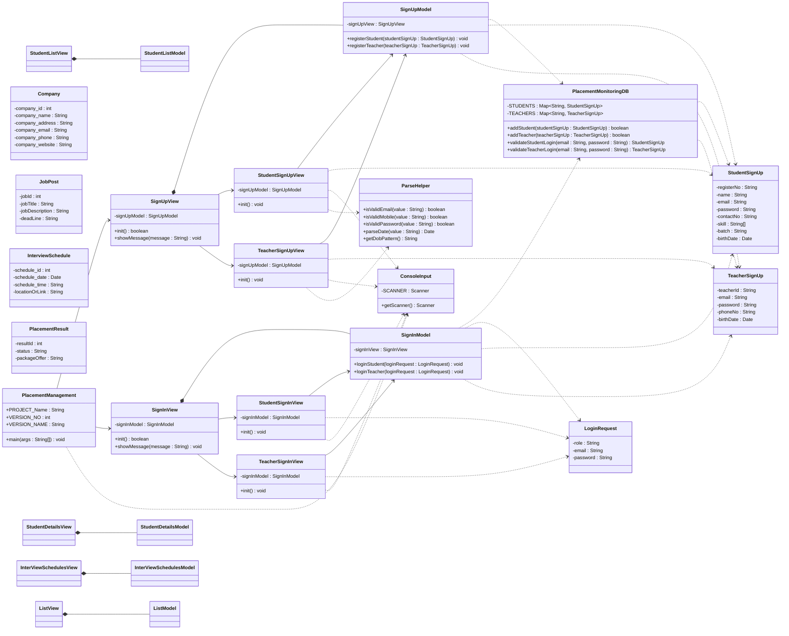

# Placement Management UML

```mermaid
classDiagram
    direction LR

    class PlacementManagement {
        +PROJECT_Name : String
        +VERSION_NO : int
        +VERSION_NAME : String
        +main(args : String[]) void
    }

    class SignUpView {
        -signUpModel : SignUpModel
        +init() boolean
        +showMessage(message : String) void
    }

    class SignUpModel {
        -signUpView : SignUpView
        +registerStudent(studentSignUp : StudentSignUp) void
        +registerTeacher(teacherSignUp : TeacherSignUp) void
    }

    class StudentSignUpView {
        -signUpModel : SignUpModel
        +init() void
    }

    class TeacherSignUpView {
        -signUpModel : SignUpModel
        +init() void
    }

    class SignInView {
        -signInModel : SignInModel
        +init() boolean
        +showMessage(message : String) void
    }

    class SignInModel {
        -signInView : SignInView
        +loginStudent(loginRequest : LoginRequest) void
        +loginTeacher(loginRequest : LoginRequest) void
    }

    class StudentSignInView {
        -signInModel : SignInModel
        +init() void
    }

    class TeacherSignInView {
        -signInModel : SignInModel
        +init() void
    }

    class PlacementMonitoringDB {
        -STUDENTS : Map~String, StudentSignUp~
        -TEACHERS : Map~String, TeacherSignUp~
        +addStudent(studentSignUp : StudentSignUp) boolean
        +addTeacher(teacherSignUp : TeacherSignUp) boolean
        +validateStudentLogin(email : String, password : String) StudentSignUp
        +validateTeacherLogin(email : String, password : String) TeacherSignUp
    }

    class StudentSignUp {
        -registerNo : String
        -name : String
        -email : String
        -password : String
        -contactNo : String
        -skill : String[]
        -batch : String
        -birthDate : Date
    }

    class TeacherSignUp {
        -teacherId : String
        -email : String
        -password : String
        -phoneNo : String
        -birthDate : Date
    }

    class LoginRequest {
        -role : String
        -email : String
        -password : String
    }

    class Company {
        -company_id : int
        -company_name : String
        -company_address : String
        -company_email : String
        -company_phone : String
        -company_website : String
    }

    class JobPost {
        -jobId : int
        -jobTitle : String
        -jobDescription : String
        -deadLine : String
    }

    class InterviewSchedule {
        -schedule_id : int
        -schedule_date : Date
        -schedule_time : String
        -locationOrLink : String
    }

    class PlacementResult {
        -resultId : int
        -status : String
        -packageOffer : String
    }

    class StudentListView
    class StudentListModel
    class StudentDetailsView
    class StudentDetailsModel
    class InterViewSchedulesView
    class InterViewSchedulesModel
    class ListView
    class ListModel

    class ConsoleInput {
        -SCANNER : Scanner
        +getScanner() Scanner
    }

    class ParseHelper {
        +isValidEmail(value : String) boolean
        +isValidMobile(value : String) boolean
        +isValidPassword(value : String) boolean
        +parseDate(value : String) Date
        +getDobPattern() String
    }

    PlacementManagement --> SignUpView
    PlacementManagement --> SignInView
    PlacementManagement ..> ConsoleInput

    SignUpView *-- SignUpModel
    SignUpView --> StudentSignUpView
    SignUpView --> TeacherSignUpView
    StudentSignUpView --> SignUpModel
    TeacherSignUpView --> SignUpModel
    StudentSignUpView ..> StudentSignUp
    TeacherSignUpView ..> TeacherSignUp
    StudentSignUpView ..> ConsoleInput
    TeacherSignUpView ..> ConsoleInput
    StudentSignUpView ..> ParseHelper
    TeacherSignUpView ..> ParseHelper
    SignUpModel ..> PlacementMonitoringDB
    SignUpModel ..> StudentSignUp
    SignUpModel ..> TeacherSignUp

    SignInView *-- SignInModel
    SignInView --> StudentSignInView
    SignInView --> TeacherSignInView
    StudentSignInView --> SignInModel
    TeacherSignInView --> SignInModel
    StudentSignInView ..> LoginRequest
    TeacherSignInView ..> LoginRequest
    StudentSignInView ..> ConsoleInput
    TeacherSignInView ..> ConsoleInput
    SignInModel ..> PlacementMonitoringDB
    SignInModel ..> LoginRequest
    SignInModel ..> StudentSignUp
    SignInModel ..> TeacherSignUp

    PlacementMonitoringDB ..> StudentSignUp
    PlacementMonitoringDB ..> TeacherSignUp

    StudentListView *-- StudentListModel
    StudentDetailsView *-- StudentDetailsModel
    InterViewSchedulesView *-- InterViewSchedulesModel
    ListView *-- ListModel
```
